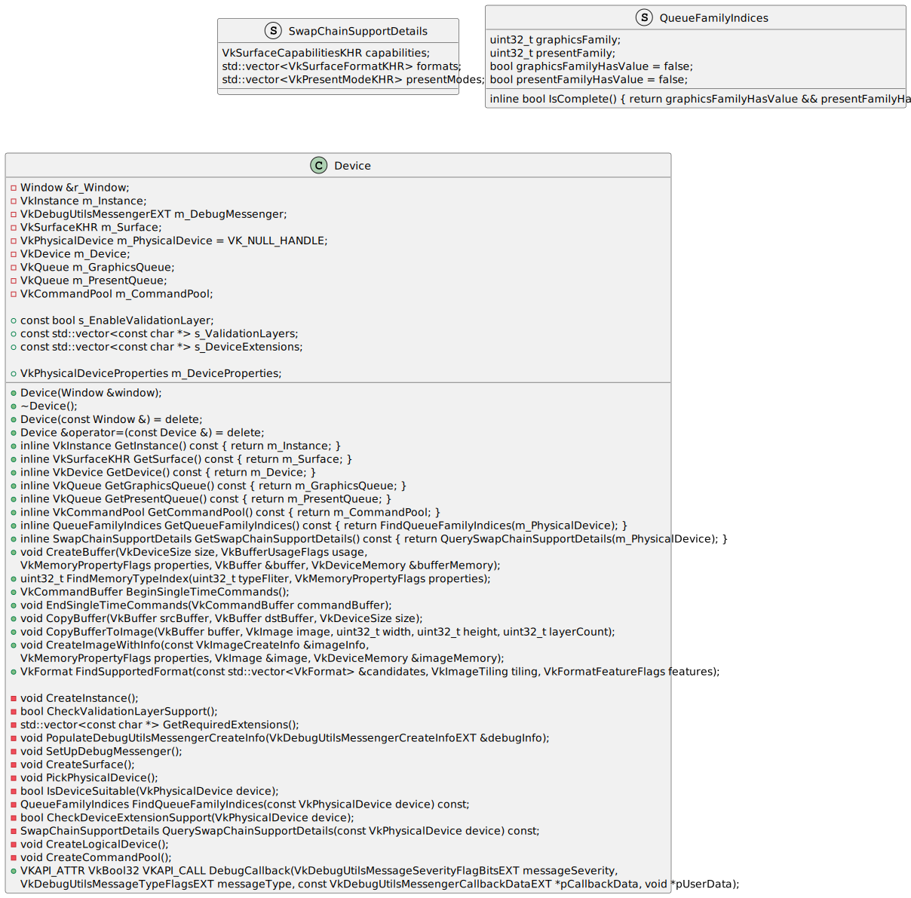
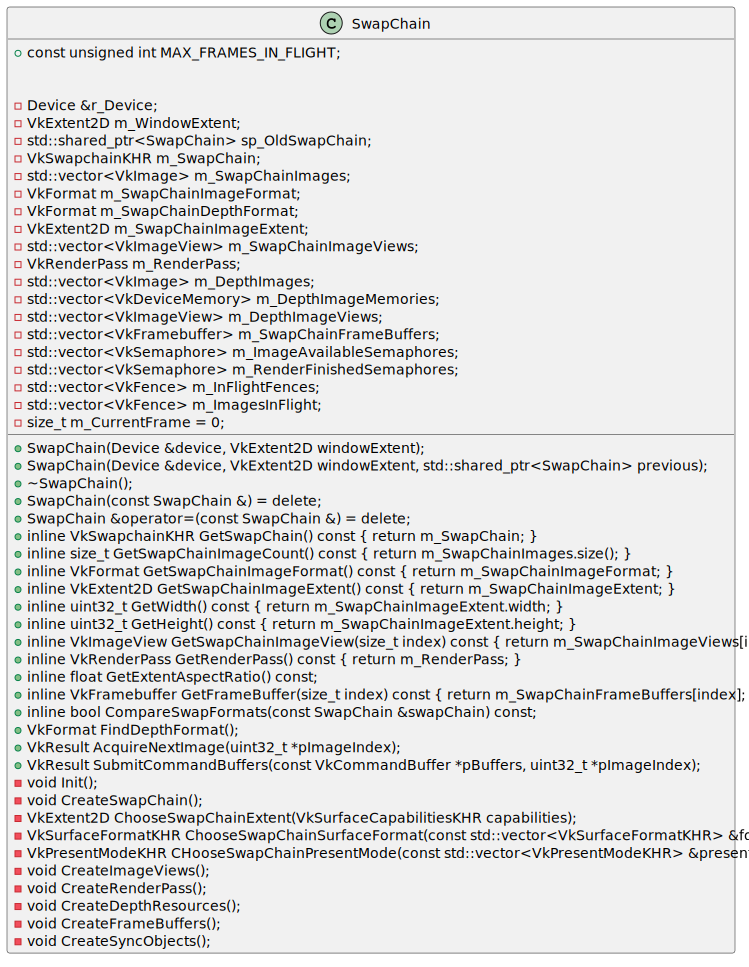

# Basic Vulkan Warper UML
This is a repository of diagrams describing [Basic Vulkan Warper](https://github.com/BravoMando/BasicVulkanWarper) implementation based on [Brendan Galea](https://github.com/blurrypiano)'s [Vulkan Tutorial project](https://github.com/blurrypiano/littleVulkanEngine).

The diagrams may look ugly☠️, but I do hope they can help understanding the structure of Vulkan. The diagrams are made of [PlantUML](https://plantuml.com/), you could change the [source files](./src/) easily to change the diagram contents.

## table of contents
*[Brief Intro](#brief-intro)

*[activity diagram](#activity-diagram)

*[class diagram](#class-diagram)

## Brief Intro

## activity diagram

## class diagram
+ Window

+ Device

+ Renderer

+ SwapChain

+ DescriptorPool

+ Buffer

+ Model

+ GameObject

+ RenderSystem

+ GraphicsPipeline

+ Camera

+ KeyboardController

+ DescriptorSetLayout

+ DescriptorWriter

